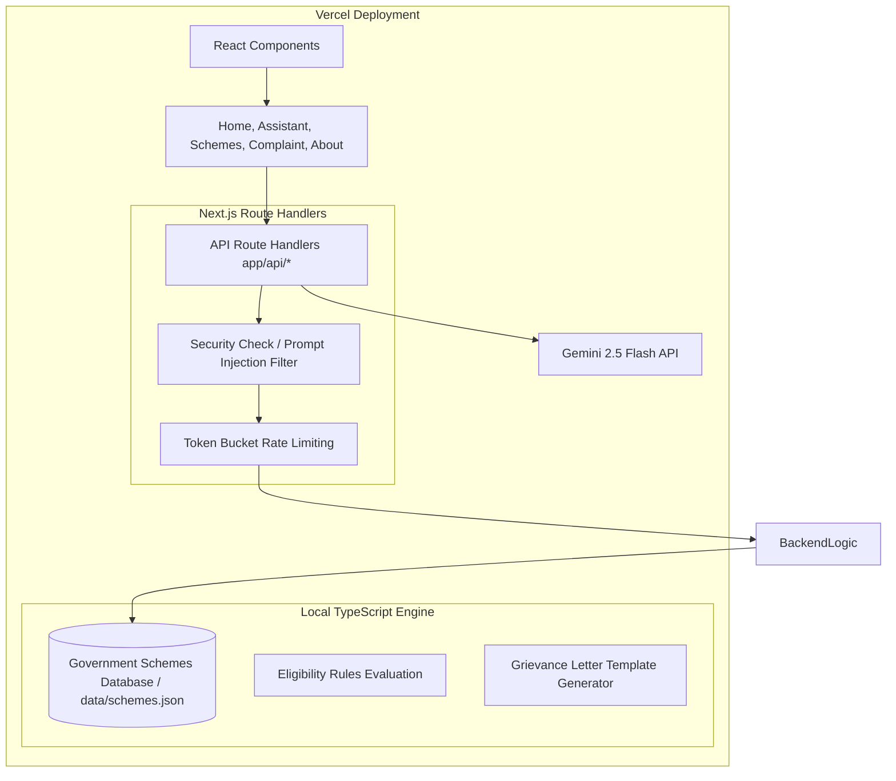

# CivicAI — Indian Government Welfare Helper & Grievance Portal

CivicAI is an AI-powered assistant designed to bridge the gap between complex government welfare terms and citizens. Built as a standalone Next.js application, it enables citizens to search national welfare schemes, evaluate dynamic eligibility criteria, and compile printable formal grievance complaint letters.

---

## Technical Architecture Blueprint



---

## Core Features

1. **Welfare Scheme Finder**: Browse and keyword-search the verified welfare database. Filter by category (Agriculture, Healthcare, Education, Housing, etc.).
2. **Dynamic Eligibility Calculator**: Enter custom demographic parameters (age, income limits, state, category, land size) to dynamically evaluate eligibility and compile document checklists.
3. **AI Chat Assistant**: Talk to the CivicAI agent in natural language to search programs or parse complex terms. Supports expanders showing real-time tool execution logs.
4. **Complaint Letter Wizard**: Walk through a step-by-step wizard to compile formal, printable grievance drafts regarding welfare disbursement delays or issues.

---

## Technology Stack

- **Framework**: Next.js 16 (React 19, TypeScript), Tailwind CSS, Lucide Icons, Shadcn components.
- **AI Agent**: Gemini 2.5 Flash (utilizing function calling/tools via standard REST integrations).
- **Database**: Local JSON-based Government Schemes Database.

---

## Installation & Setup

CivicAI runs completely inside a single Next.js Node.js runtime. Follow these steps to run the application locally:

### 1. Configure Environment Variables
Create a `.env` file in the root directory:
```text
GEMINI_API_KEY=your_google_gemini_api_key
NODE_ENV=development
```

### 2. Set Up & Run the Next.js Application
The app runs on port `3000` via Next dev.

```bash
# Install NPM dependencies
npm install

# Start the Next.js server
npm run dev
```

Open `http://localhost:3000` in your web browser to access the portal.

