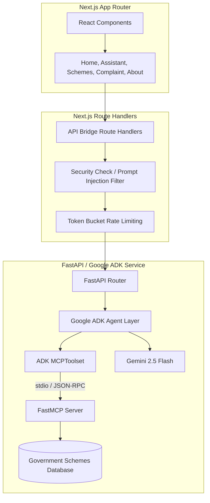

# CivicAI — Indian Government Welfare Helper & Grievance Portal

CivicAI is an AI-powered assistant designed to bridge the gap between complex government welfare terms and citizens. Built with a Next.js frontend and a Python ADK service backend, it enables citizens to search national welfare schemes, evaluate dynamic eligibility criteria, and compile printable formal grievance complaint letters.

---

## Technical Architecture Blueprint



---

## Core Features

1. **Welfare Scheme Finder**: Browse and keyword-search the verified welfare database. Filter by sector focus (Agriculture, Healthcare, Education, Housing).
2. **Dynamic Eligibility Calculator**: Enter custom demographic parameters (age, income limits, state, category, land size) to dynamically evaluate eligibility and compile document checklists.
3. **AI Chat Assistant**: Talk to the CivicAI agent (orchestrated with Google ADK) in natural language to search programs or parse complex terms. Supports expanders showing real-time tool execution logs.
4. **Complaint Letter Wizard**: Walk through a step-by-step wizard to compile formal, printable grievance drafts regarding welfare disbursement delays or issues.

---

## Technology Stack

- **Frontend**: Next.js 15 (React 19, TypeScript), Tailwind CSS, Lucide Icons, Shadcn components.
- **AI Agent & Backend**: Python 3.13, Google ADK (Agent Development Kit), FastMCP (Model Context Protocol), FastAPI, Uvicorn, Google GenAI SDK.
- **Database**: Local JSON-based Government Schemes Database.

---

## Installation & Setup

CivicAI uses a Twin Runtime environment (Next.js Node server + Python Uvicorn server). Follow these steps to run the application locally:

### 1. Configure Environment Variables
Create a `.env` file in the root directory:
```text
GEMINI_API_KEY=your_google_gemini_api_key
NODE_ENV=development
```

### 2. Set Up & Run the Python Backend
The backend runs on port `8000` via Uvicorn.

```bash
# Install Python dependencies
pip install -r api/requirements.txt

# Start the FastAPI backend
python api/index.py
```

### 3. Set Up & Run the Next.js Frontend
The frontend runs on port `3000` via Next dev.

```bash
# Install NPM dependencies
npm install

# Start the Next.js frontend
npm run dev
```

Open `http://localhost:3000` in your web browser to access the portal.

---

## Running Automated Tests

A Python unit test suite is included to verify database schema queries, rules engine limits, and letter formatting.

```bash
python -m unittest api/test_tools.py
```
